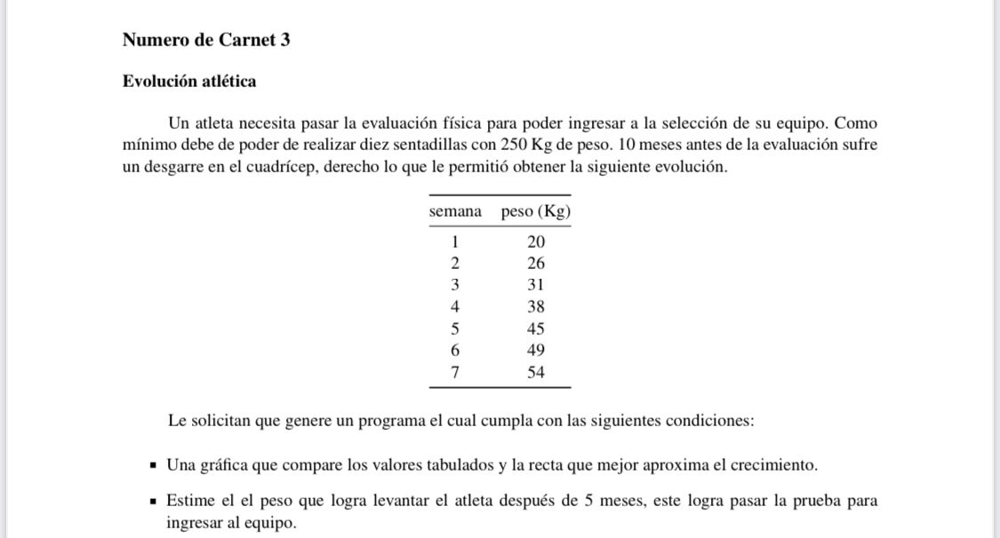
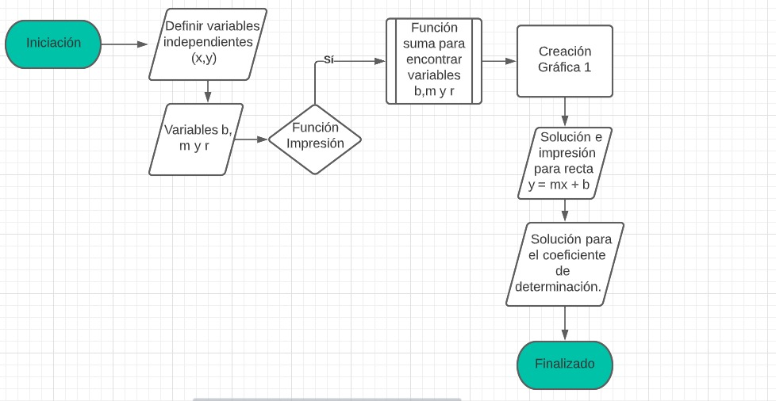
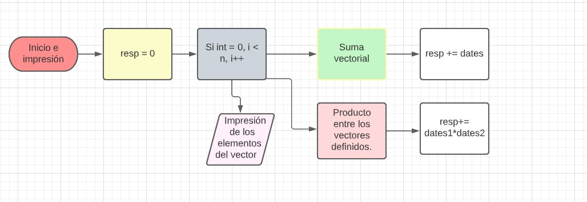
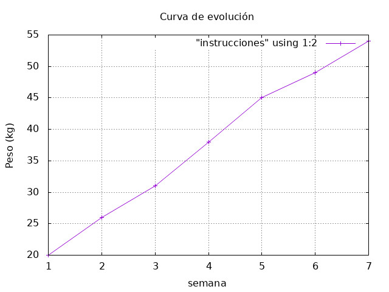
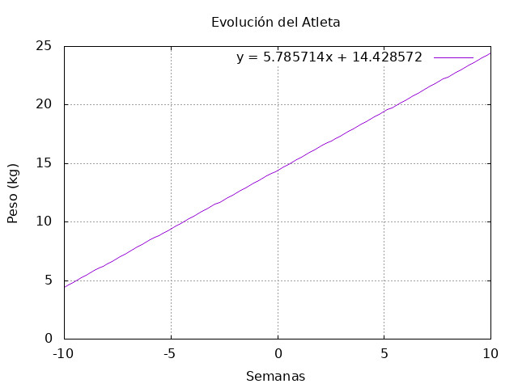
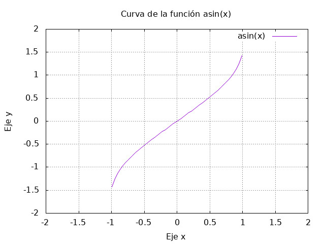

# Segundo parcial (201804563)

Dentro de esta carpeta se documentará y mostrará el código de los problemas del segundo examen parcial de Laboratorio de simulación.

### **Problema 1**



**Diagrama de flujo**



**Variables de entrada y salida:**
- x   = Semanas de entreno
- y   = Vector que almacena la información del peso (kg) que puede levantar el atleta por semana
- b   = Intercepto
- m   = Pendiente
- r   = Coeficiente de correlación
- anh = Valor asignado a x en la función y = mx +b para dar la aproximación del peso levantado 
- ans = Valor del peso levantado en la semana por el atleta
- resp = Respuesta de m*ans + b

**Metodología:**
- Se divide el problema en 3 funciones para luego llamarlas durante el programa
- Se hace una función que imprima los datos de los vectores ingresados llamada "imprimir"
- Se crea una función que realiza la suma de los elementos de los vectores ingresados llamada "suma"
- Se hace una función que realiza el "producto punto" de los dos vectores ingresados. Esta se llama "sumaMulti"
- Se llama la función "imprimir" para presentar los valores de x y y.
- Se genera la primera gráfica usando los valores de la tabla.
- Se calcula el valor de m según la fórmula matemática. Para esto, se llaman las funciones "sumaMulti" y "suma"
- Se halla el valor de b usando las funciones "suma" y "sumaMulti"
- Se calcula el valor de r. De nuevo, se usan las funciones "suma" y "sumaMulti".
- Se pide al usuario ingresar la semana del que desea saber el peso levantado por el atleta.
- Se guarda el dato ingresado por el usuario para luego meterlo en una nueva operación y así obtener el peso levantado.
- Se genera la segunda gráfica tomando en cuenta la recta generada por el programa.

**Respuestas del problema**
- Recta que que mejor aproxima el crecimiento en el peso: y = 5.785714x + 14.428572
- Gráfica inicial de los datos 
- 
- Gráfica de y = 5.785714x + 14.428572 
- 
- El peso que el atleta lograría levantar despues de 5 meses (semana 20) utilizando el método de mínimos cuadrados es de 130.142852kg. Con esta información, concluimos que no logra pasar la prueba física después de los 10 meses de su lesión.

**Compilación y ejecución:**
```
 $ gcc -o MinCuadrados.out MinCuadrados.c -lm
 $ ./MinCuadrados.out
 ```

 ### **Problema 2**


**Diagrama de flujo**

**Variables de entrada y salida:**
- x0   = Estimación inicial de la raíz (variable de entrada)
- e    = Error tolerable en la obtención de la raíz (variable de entrada)
- N    = Número máximo de iteraciones (variable de entrada)
- Itr  = Contador de las iteraciones en el método numérico 
- f(x) = Función a la que se desea obtener las raíces
- g(x) = Derivada de la función f(x)
- f0   = f(x) valuada en 0 (f0 = f(0))
- g0   = g(x) valuada en 0 (g0 = g(0))
- x1   = Valor que se obtiene de la operación x0 - f0/g0
- f1   = f(x) valuada en x1 (f1 = f(x1))

**Metodología:**
1. Inicio
2. Se define f(x)
3. Se define la primera derivada de f(x) como g(x)
4. Se solicita la estimación inicial (x0), el error tolerable (e) y número máximo de iteraciones (N)
5. Se inicializa el contador Itr = 1
6. Si g(x0) = 0 entonces se imprime "Error matemático" y se dirige a (12). De lo contrario se direcciona a (7) 
7. Se calcula x1 = x0 - f(x0) / g(x0)
8. Se aumenta el contador Itr = Itr + 1
9. Si i >= N entonces se imprime "No convergente" y se dirige a (12), caso contrario se dirige a (10) 
10. Si |f(x1)| > e entonces se deja x0 = x1 y se dirige (6), caso contrario se dirige a (11)
11. Se imprime la raíz x1
12. Finaliza el programa

**Respuestas del problema**
- La raíz de la función f(x) = asin(x) es 0
- Gráfica de la función f(x) = asin(x)
- 
- Haciendo la comparación entre la gráfica de f(x) y el valor encontrado por el programa, se puede notar que ambos resultados son bastante parecidos


**Compilación y ejecución:**
```
 $ gcc -o Newt-Raph.out -lm Newt-Raph.c -lm
 $ ./Newt-Raph.out
 ```